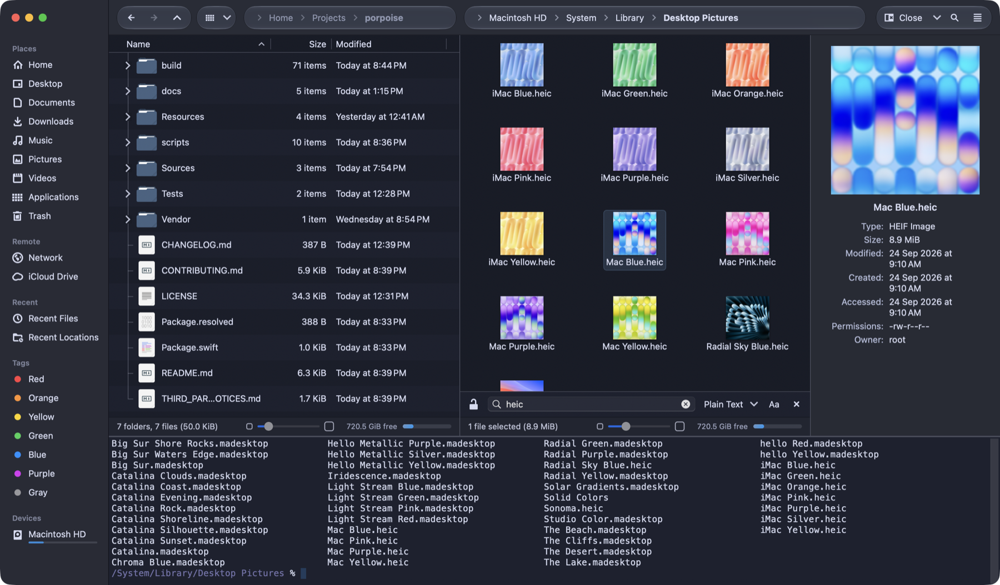
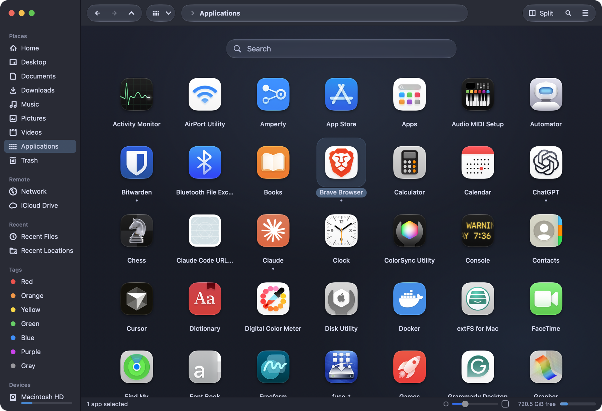

# Porpoise

**A fast, keyboard-friendly file manager for macOS, inspired by KDE Dolphin.**

Split view, a built-in terminal that follows the folder you're in, tabs, panels, Finder tags, remote folders over
SSH/FTP, and previews of every video format, in a native Mac app with a dark Desert theme and Tela icons.





> Porpoise is an independent, open-source project. It follows KDE Dolphin's layout and behaviour (thank you, KDE!),
> but it is not affiliated with KDE.

## Install

1. Download [**Porpoise.dmg**](https://github.com/El3ssar/porpoise/releases/latest/download/Porpoise.dmg) (or pick a version on the [releases page](https://github.com/El3ssar/porpoise/releases)).
2. Open it and drag **Porpoise** onto **Applications**.
3. Open Porpoise. Because Porpoise isn't signed through Apple's paid developer program, macOS blocks it the first
   time: open **System Settings › Privacy & Security**, scroll to *"Porpoise was blocked…"* and click **Open Anyway**.
   You only do this once. (Terminal alternative: `xattr -dr com.apple.quarantine /Applications/Porpoise.app`.)
4. Porpoise's welcome window walks you through the permissions it needs, once: **Full Disk Access** (every folder,
   including the Trash), **App Management** (moving and deleting apps), **Administrator Actions** (system-owned items such
   as App Store apps, confirmed with Touch ID) and **Local Network** (file servers). After that it never asks again.
   You can revisit them any time in *Porpoise › Permissions…*.

Requirements: a Mac with Apple Silicon and **macOS 15 Sequoia or newer**. Everything Porpoise needs is inside the
app; nothing else to install. (Android phones need Google's adb tool, which Porpoise downloads for you from
*Settings › System* if you want it.)

Updates: Porpoise checks once a day and updates itself in place: one click, it installs and relaunches, and your
permissions stay. Turn the daily check (or fully automatic updates) on or off in Settings › General, or check any time
with *Porpoise › Check for Updates…*.

## Features

- **Window:** toolbar with Back/Forward/Up, breadcrumb or editable location bar, tabs, split view (F3) with one
  location bar per pane, full-width status bar with free space and a zoom slider.
- **Views:** Icons, Compact and Details (expandable folders, sortable/resizable/reorderable columns), smooth zoom
  (pinch, slider, ⌘+/−), previews of images, documents and every video format, grouping, natural sorting,
  type-ahead, inline rename, rubber-band and selection mode, filter bar, Spotlight search.
- **Applications:** an app library instead of a plain folder: every app (including Apple's own) as big icons, a
  search field you can type into right away, with the results animating into place. Delete apps with ⌘⌫ or by
  dragging them to the Trash in the Dock, with Finder's sounds; drop an app from a disk image to install it.
- **Panels:** Places (foldable, reorderable sections; devices with capacity bars and eject; tags; network), Folders
  tree, Information (big preview, metadata, inline video/audio player) and a **Terminal** (F4) running your own
  shell that follows the view, and the view follows it.
- **Files:** copy/move/link/trash with progress and undo, Dolphin's drop menu, conflict dialog, Create New,
  Duplicate, Compress/Extract, Properties (permissions, Open with + Change All, tags, comments, locked), Restore
  from Trash, admin authentication for protected items.
- **Finder parity:** Quick Look (Space), tags with colours, aliases, Get Info, Go to Folder and Finder's keyboard
  shortcuts, Services, AirDrop/Share, iCloud and cloud-drive status with Download Now / Remove Download, Smart
  Folders, Eject, drag & drop with any app and the Dock Trash; optionally the default file browser for
  "Show in Finder".
- **Remote:** SFTP/SSH, FTP/FTPS, SMB/AFP/NFS/WebDAV (Connect to Server ⌘K), Bonjour network browsing, Android
  phones over USB, archives browsed as folders.

## Keyboard shortcuts

Dolphin's shortcuts with Ctrl → ⌘, plus Finder's.

| Action | Key |
|---|---|
| Back / Forward / Up | ⌫ or ⌘[ / ⌘] / ⌘↑ |
| Switch split pane | ⌥← / ⌥→ |
| Open | Return, ⌘O or ⌘↓ |
| Move to Trash / Delete permanently | ⌘⌫ / ⌘⌥⌫ |
| Show hidden files | ⌘H or ⌘⇧. |
| Quick Look | Space |
| Selection mode | ⌘⇧Space (or ⌘C/⌘X/F2 with nothing selected) |
| Split / Terminal / Places / Folders / Information | F3 / F4 / F9 / F7 / F10 |
| Filter / Search / Location | ⌘I or / / ⌘F / ⌘L |
| View modes | ⌘1 ⌘2 ⌘3 |
| Focus Places (toggle) | ⌘P |
| View display style | ⌘J |
| Settings | ⌘, |
| Go to Folder | ⌘⇧G |
| Recents / Documents / Desktop / Downloads | ⌘⇧F / ⌘⇧O / ⌘⇧D / ⌘⌥L |
| Computer / Applications / Utilities / Library | ⌘⇧C / ⌘⇧A / ⌘⇧U / ⌘⇧L |
| iCloud Drive / AirDrop / Network / Connect to Server | ⌘⇧I / ⌘⇧R / ⌘⇧K / ⌘K |
| Make Alias / Show Original | ⌃⌘A / ⌘R |
| New Folder / New Folder with Selection | ⌘⇧N / ⌃⌘N |
| Duplicate / Eject / Empty Trash | ⌘D / ⌘E / ⌘⇧⌫ |

## Support Porpoise

Porpoise is free and always will be. If it's useful to you, you can support its development through
[GitHub Sponsors](https://github.com/sponsors/El3ssar) (also in *Help › Support Porpoise*). Bug reports and ideas are
just as welcome: [open an issue](https://github.com/El3ssar/porpoise/issues).

## Build from source

You need macOS 15+ on Apple Silicon and Xcode 26 (or its Command Line Tools).

```bash
./scripts/make-app.sh             # builds build/Porpoise.app (the first run also builds the bundled FFmpeg)
./scripts/make-app.sh --install   # …and copies it to ~/Applications
./scripts/make-dmg.sh             # release disk image in build/
swift test                        # unit tests
```

See [CONTRIBUTING.md](CONTRIBUTING.md) for the project layout, the test bridge used to check the running app,
and how releases are made.

## Licence and credits

Porpoise is free software under the **GNU General Public License v3.0 or later** ([LICENSE](LICENSE)).

- Layout and behaviour follow [KDE Dolphin](https://apps.kde.org/dolphin/).
- Icons: [Tela circle](https://github.com/vinceliuice/Tela-circle-icon-theme) by Vince Liuice (GPL-3.0).
- Colours: Desert theme by L4ki (AGPL-3.0).
- Terminal: [SwiftTerm](https://github.com/migueldeicaza/SwiftTerm) by Miguel de Icaza (MIT).
- Video previews: [FFmpeg](https://ffmpeg.org) (LGPL-2.1), bundled as a separate program.
- Symbols Nerd Font (MIT).

Details in [THIRD_PARTY_NOTICES.md](THIRD_PARTY_NOTICES.md).
